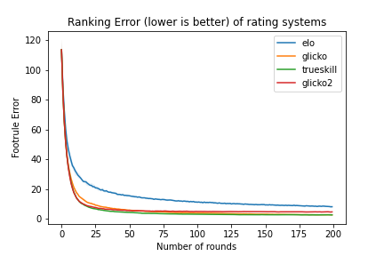
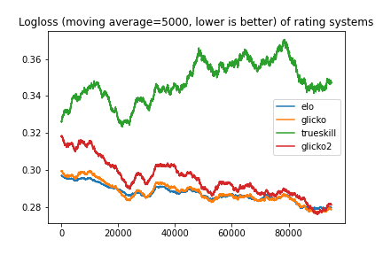

# Evaluation of rating systems

There are a few popular rating systems to choose from, such as ELO, Glicko and Trueskill. The various systems have their pros and cons. Evaluating rating systems can be hard, and they are usually done academically, or on historical datasets which precludes the effect of matchmaking or on closed systems where only the owner has access to. This problem is made harder when rating systems are to be used for game modes which they are not designed for, such as FFA or team mode.

This project is an attempt to build fair scenarios for evaluating rating systems across a variety of modes. In this README.md, the scenarios will be described and the results of the evaluation are presented. In scenario_evaluation.md, the scenario design will be explained in greater detail, as well as presenting case studies to build evidence for the validity of the tests.

## Rating Systems

Rating systems were obtained from PyPI repo.

* [ELO](https://pypi.org/project/elo/)
* [Glicko](https://pypi.org/project/skills/)
* [Glicko2](https://pypi.org/project/glicko2/) 
* [Trueskill](https://pypi.org/project/trueskill/) - [Trueskill from skills library](https://pypi.org/project/skills/) gives similar results on basic testing.

The following default player values for each system are:
* ELO - rating=1200, k_factor=32
* Glicko - rating=1500, stdev=200
* Glicko2 - rating=1500, rd=350, vol=0.06
* Trueskill - mu=25, sigma=8.333

## Scenario 1

Scenario 1 consists of the classic 1v1 matchup. 

500 players are generated, having a rating from a normal distribution of mean=3000, sd=2000, and a standard deviation from a uniform distribution of 0 to 10.

When two players are matched-up against each other, 2 numbers are generated for each player, from a normal distribution of mean=rating, sd=standard deviation of the respective players. Hence, each player has a number range. If the number ranges of the two players overlap, the round is a draw. Otherwise, the player with the higher number range wins the round.

200 rounds are played. In each round, the pairings are determined by the following procedure:

```
1. Players are sorted according to their current matchmaking rating (e.g. [1400, 1450, 1490, 1520, ...])
2. A running window of 50 is performed across the array of players, where the indices of players are shuffled uniformly within the window at each step. (e.g. after first step, [1490, 1400, 1520, 1450, ...(first 50), 1900, 1910, 1930, ...] )
3. Players are matched against their adjacent index. (e.g. [1490 vs 1400, 1520 vs 1450, ...])
```

As each player only plays 1 game per round, all ratings are essentially simultaneously updated at the end of each round.

### Evaluation Metric

The [Kendall-Tau coefficient](https://en.wikipedia.org/wiki/Kendall_rank_correlation_coefficient) is calculated after each round. This is a measure of how well-sorted a sequence is, where a score of 1 indicates that the players are fully sorted with regards to their ratings, while a score of 0 indicates that the players are randomized with regards to their ratings. As all players are initialized with the same default ratings and shuffled, the initial Kendall-Tau score is 0.

The Kendall-Tau score can get quite noisy, so we apply a moving average of 10.

As RNG is used within the simulation, we run 10 simulations for each rating system to obtain a better statistical picture. The mean is plotted as a solid line, while the max and min are plotted as the shaded areas.

### Results



Trueskill performed the best, while Glicko managed to catch up later on.


## Scenario 2

Scenario 2 consists of a [chess dataset obtained from Kaggle](https://www.kaggle.com/c/ChessRatings2/data). The processed dataset (removing unneccessary columns) can be found in this repo at dataset/ChessRatings2/primary_training_part1.csv. There are ~624k games.

We use this dataset as a real-world test of the rating systems.

There are initial ELO ratings provided for ~25% of players in the Kaggle dataset, but we do not use them because of the difficulty in translating them fairly to different rating systems.

### Evaluation Metric

Logloss, moving average of last 5000 games. The lower the logloss score, the better. A model that always predicts draws will have a score of ~0.30.

### Results




ELO, Glicko and Glicko2 converges to similar logloss scores, but Trueskill's logloss never does better than the baseline always-draw model.


## Caveats

In the use of Glicko/Glicko2, the ratings are recommended to be evaluated for multiple matches at a time (5-10). However, for many purposes such as online games, ratings are neccessarily updated after every match, and used for matchmaking immediately after. It is possible to retroactively rerun Glicko/Glicko2, or use a running window, but this may result in rating loss after a win, which is a major feel-bad factor for the player. Hence, we choose to evaluate ratings after each match.


## Running the simulations

We reccommend using a REPL that also has support for graphics for plots, to play around with the code.

### Reproducing results

Use the following instructions to output the plots that are in this page.

```
# Clone repo
git clone https://github.com/lohjine/rate_rating_systems.git
cd rate_rating_systems

# Install requirements
pip3 install -r requirements.txt

# Takes approximately 15 minutes to run
python3 rate_rating_systems.py

# Resulting plots will be in img/ folder
```


