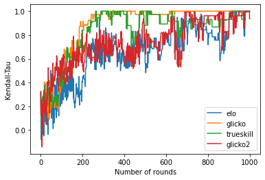
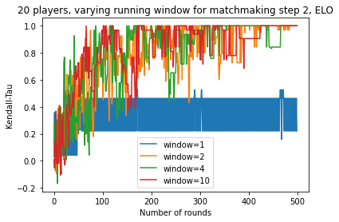
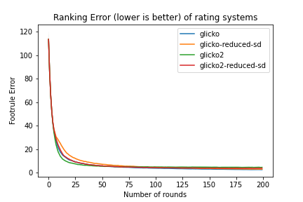
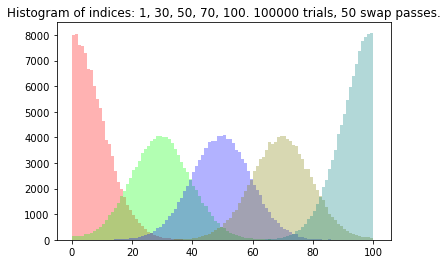

# Scenario 1

Scenario 1 consists of the classic 1v1 matchup. 

500 players are generated, having a rating from a normal distribution of mean=3000, sd=2000, and a standard deviation from a uniform distribution of 0 to 10. This is to mimic a typical human population that forms a normal distribution, and a variance in individual human skill.

When two players are matched-up against each other, 2 numbers are generated for each player, from a normal distribution of mean=rating, sd=standard deviation of the respective players. Hence, each player has a number range. If the number ranges of the two players overlap, the round is a draw. Otherwise, the player with the higher number range wins the round.

200 rounds are played. In each round, the pairings are determined by the following procedure:

```
1. Players are sorted according to their current matchmaking rating (e.g. [1400, 1450, 1490, 1520, ...])
2. 50 passes of swapping are done. In each pass across the array, we swap adjacent indices with probability 50%. For each alternate pass, we swap the direction of traversal through the array.
3. Players are matched against their adjacent index. (e.g. [1490 vs 1400, 1520 vs 1450, ...])
```

As each player only plays 1 game per round, all ratings are essentially simultaneously updated at the end of each round.

## Demonstration that Kendall-Tau converges correctly

In this case, we set players' standard deviation to 0 to remove the chance of a draw. Number of players are set to 40 so convergence is faster. Running window is set to 40, which means that matchmaking is completely random.

In this plot, the moving average of Kendall-Tau score is set to 1, and we only run 1 simulation for each rating system.




## Investigating the effect of running window in matchmaking

In the design of the matchmaking, we want to match players of close skill to each other. This is to test effect of matchmaking step 2 running window size. Kendall-Tau running average is set to 1. For window size=1, this reduces to no shuffling, players are matched against the closest skill.




## Investigating the effect of reducing Glicko/Glicko2 stdev loss

In the use of Glicko/Glicko2, the ratings are recommended to be evaluated for multiple matches at a time (5-10). However, in scenario 1, we evaluate single matches at a time. One consequence is that the stdev is reduced much faster than would normally be expected to.

In this run, we half the stdev loss for each match by taking the mean of the original and adjusted stdev.



We see significant improvement to Glicko2, but similar performance for Glicko.


## Empirical results of shuffling algorithm

We run the shuffling algorithm for 100 players, with 50 swap passes, for 100000 trials. The resulting histogram for indices 1, 30, 50, 70, 100 are plotted, which shows a close-to-gaussian distribution for each of the 5 indices.




## Unsuitability of Kendall-Tau metric for ranking

Initially, we used [Kendall-Tau coefficient](https://en.wikipedia.org/wiki/Kendall_rank_correlation_coefficient) to evaluate how well-sorted the player ranking is after each round. However, it turned out to be unsuitable due to degenerate conditions. Instead we use [Spearman's footrule](https://people.revoledu.com/kardi/tutorial/Similarity/FootruleDistance.html), implemented in code as:

```
def ranking_error(a,b):
    a = np.array(a)
    b = np.array(b)
    error = 0
    for idx, i in enumerate(a):
        error += np.abs(idx - np.where(b==i)[0][0])
    return error/len(a)
```

In plain English, the error of an element is the difference between its index and the correct index it should be at. We sum up this error for every element, and normalize it by dividing by the number of elements. Lower error is better.

We will demonstrate the degenerate cases where Kendall-Tau fails, but the Spearman's footrule does not.

```
# In this example, we expect to have a better correlation between s_correct and s1, as compared to s_correct and s2. s2 has been randomly shuffled.
# kendall-tau should have a higher score for s_correct and s1, while footrule should have a lower score for them

s_correct = [32, 37, 7, 2, 53, 21, 20, 14, 42, 3, 50]
s1        = [32, 7, 37, 53, 2, 21, 20, 42, 14, 50, 3]
s2        = [7, 37, 3, 20, 42, 32, 50, 2, 53, 21, 14]


kendalltau(s_correct, s1)
>>> KendalltauResult(correlation=-0.8181818181818182, pvalue=0.00013227513227513228)
footrule(s_correct, s1)
>>> 0.7272727272727273

kendalltau(s_correct, s2)
>>> KendalltauResult(correlation=0.3090909090909091, pvalue=0.21834651074234407)
footrule(s_correct, s2)
>>> 3.6363636363636362


# This example is similar, but with a longer sequence. s2 has been randomly shuffled.

s_correct = [32, 37, 7, 2, 53, 21, 20, 14, 42, 3, 50, 10, 27, 46, 41, 43, 18, 4, 52, 9, 51, 15, 1, 35, 38, 19, 0, 24, 30, 34, 36, 48, 55, 54, 8, 45, 16, 6, 39, 28, 26, 47, 11, 22, 33, 44, 13, 49, 17, 25, 12, 5, 23, 40, 29, 31]
s1 = [32, 7, 37, 53, 2, 21, 20, 42, 14, 50, 3, 46, 27, 10, 41, 18, 43, 4, 52, 9, 51, 15, 35, 1, 38, 19, 24, 30, 0, 34, 48, 36, 55, 8, 16, 54, 6, 45, 39, 26, 28, 11, 22, 47, 33, 13, 44, 17, 25, 49, 12, 5, 23, 40, 29, 31]
s2 = [26, 4, 14, 36, 6, 48, 41, 17, 49, 0, 7, 35, 46, 10, 44, 9, 13, 8, 53, 25, 37, 15, 45, 30, 31, 34, 20, 27, 52, 1, 47, 5, 16, 43, 33, 32, 19, 3, 38, 29, 54, 24, 40, 11, 22, 55, 28, 51, 2, 42, 21, 18, 12, 23, 39, 50]

kendalltau(s_correct, s1)
>>> KendalltauResult(correlation=0.0025974025974025974, pvalue=0.9774466961370482)
footrule(s_correct, s1)
>>> 0.75

kendalltau(s_correct, s2)
>>> KendalltauResult(correlation=0.1168831168831169, pvalue=0.20331759551837802)
footrule(s_correct, s2)
>>> 17.892857142857142

```

This result arises because Kendall-Tau does not penalize based on indices. Kendall-Tau only takes into account whether each pair comparison is in the right order or not. I.E. the error for (a,b) pairing, assuming b should be ranked later than a, is the same for [b,..,..,..,a] and [..,..,..,b,a].


